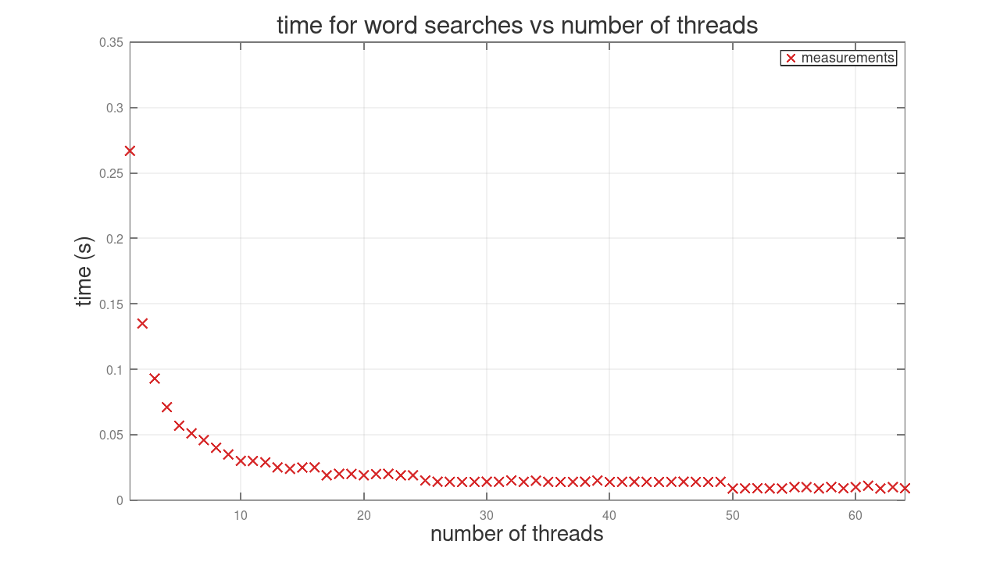
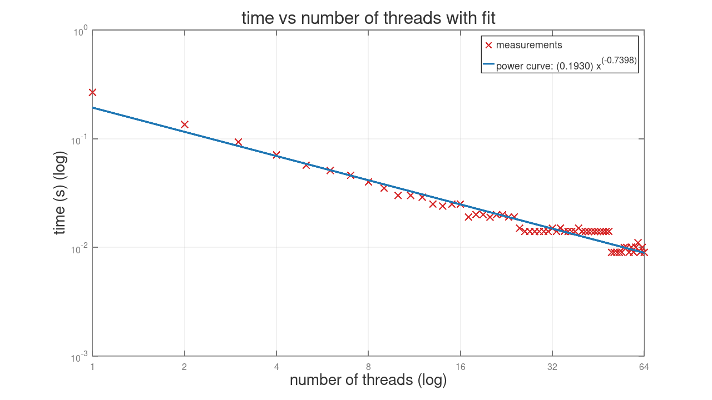

# thread_search
Seeing how much faster threads make substring searches
 * generate random word list from `/usr/share/dict/words` with `genwords.py`
 * `a.out`: count the number of occurrences of a word in the document
   (check with `grep -o <phrase> wordy.txt | wc -l`)
 * change number of threads with `make FLAGS="-DNUM_THREADS=8"`
 * `analysis.sh` generates a csv of runtimes vs num threads
 * `analysis.m` creates a plot of those runtimes and fits a power curve

